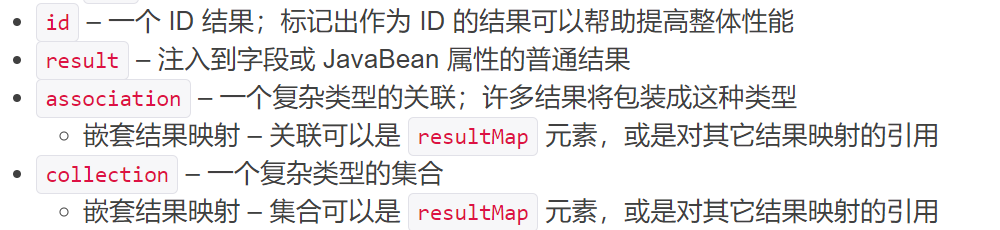
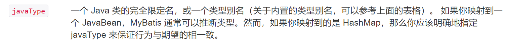

## 一对多处理

一个老师对应于多个学生，对于老师而言就是一对多的关系。

### 环境搭建

```java
public interface TeachMapper {
    //获取所有老师
    List<Teacher> getTeacher();

    //获取指定老师下的所有学生及老师信息
    //方式一：按照结果查询
    Teacher getTeacherStu(@Param("tid") int id);
    //方式二：子查询
    Teacher getTeacherStu2(@Param("tid") int id);
}
```


```java
@Data
@AllArgsConstructor
@NoArgsConstructor
public class Teacher {
    private int id;
    private String name;

    //一个老师对应多个学生
    private List<Student> students;
}
```

### 按照结果嵌套处理

使用嵌套的结果映射来处理连接结果的重复子集。

非常重要： id 元素在嵌套结果映射中扮演着非常重要的角色。你应该总是指定一个或多个可以唯一标识结果的属性。 虽然，即使不指定这个属性，MyBatis 仍然可以工作，但是会产生严重的性能问题。 只需要指定可以唯一标识结果的最少属性。显然，你可以选择主键（复合主键也可以）。

```xml
<!--    按照结果嵌套查询:比子查询清楚很多-->
    <select id="getTeacherStu" resultMap="TeachStudent">
        select s.id sid,s.name sname,t.name tname,t.id tid
        from student s, teacher t
        where s.tid = t.id and t.id = #{tid};
    </select>
<!--    结果集映射-->
    <resultMap id="TeachStudent" type="Teacher">
        <id property="id" column="tid"/>
        <result property="name" column="tname"/>
<!--        javaType:指定属性的类型；而集合中的泛型信息，我们用ofType获取-->
        <collection property="students" ofType="Student">
            <id property="id" column="sid"/>
            <result property="name" column="sname"/>
            <result property="tid" column="tid"/>
        </collection>
    </resultMap>
```


### 按照查询嵌套处理

通过执行另外一个 SQL 映射语句来加载期望的复杂类型。

```xml
    <select id="getTeacherStu2" resultMap="TeachStudent2">
        select * from teacher where id = #{tid}
    </select>

    <resultMap id="TeachStudent2" type="Teacher">
        <result property="id" column="id"/>
        <collection property="students" javaType="ArrayList" ofType="Student" select="getStu" column="id"/>
    </resultMap>

    <select id="getStu" resultType="Student">
        select * from student where tid = #{tid}
    </select>
```

### 小结

1. 关联：association    【多对一】

2. 集合：collection    【一对多】

3. javaType/ofType
   1. javaType用来指定实体类中属性的类型（很多时候 MyBatis 可以自己推断出来）。
   2. ofType用来指定映射到List等集合中的pojo类型，泛型中的约束类型。
   
4. 注意点
   1. 保证SQL的可读性，在按照结果嵌套处理中，SQL语句复杂但映射简单，在按照查询嵌套处理中，SQL语句简单但映射复杂，因此，应尽量保证通俗易懂。
   2. 注意属性名和字段的问题。
   3. 如果问题不好排查错误，可以使用日志，建议LOG4J。
   4. 写好高性能的SQL语句很重要。
   5. 面试高频：
      1. MySQL引擎
      2. InnoDB底层原理
      3. 索引
      4. 索引优化
   
   官方文档：
   
   



